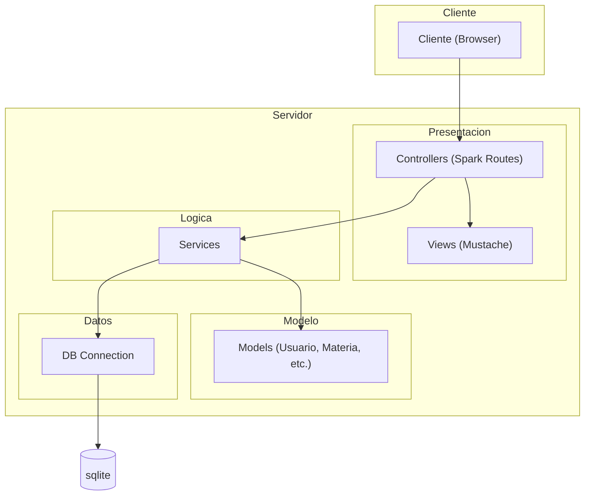

# Arquitectura

## Estructura general

Routes Spark
→ Controllers
→ Services
→ Models ActiveJDBC
→ SQLite

## Controllers

Responsabilidades:

- Manejar requests HTTP
- Validar parámetros básicos
- Renderizar vistas Mustache
- Redireccionar

NO deben:

- Tener lógica de negocio compleja
- Hacer consultas complejas a modelos
- Duplicar validaciones

## Services

Responsabilidades:

- Lógica de negocio
- Validaciones
- Consultas a modelos
- Reglas académicas
- Manejo de correlatividades

## DAO

El proyecto NO utiliza DAO.
Los Services interactúan directamente con ActiveJDBC.

## Vistas

Se usa Mustache.

Los controllers pueden renderizar vistas directamente.

## diagrama de arquitectura

