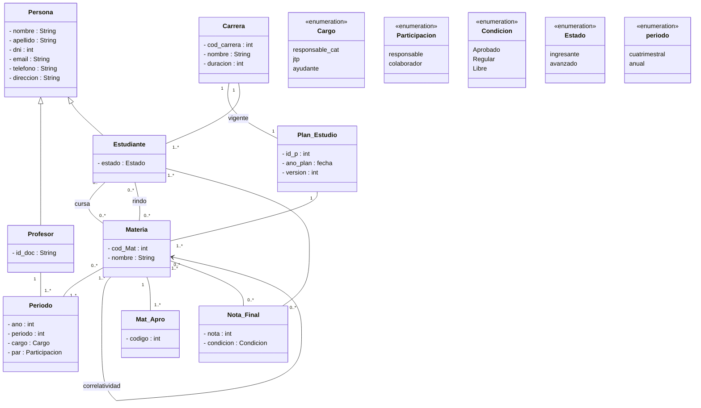
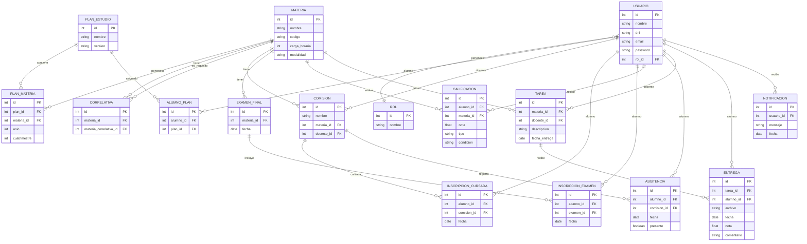
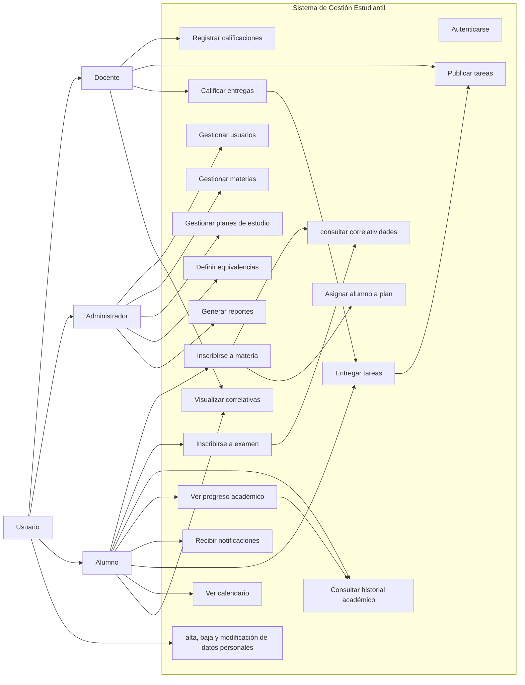
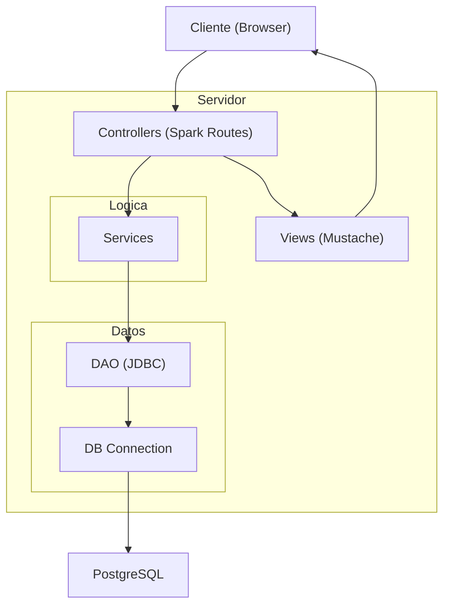
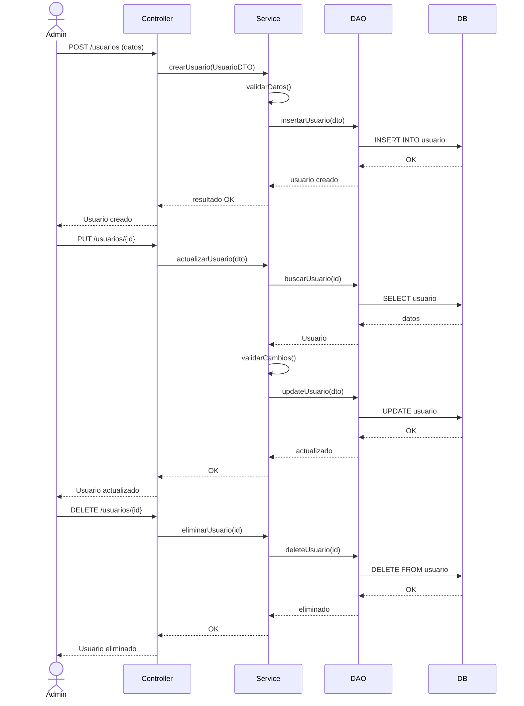

<<<<<<< HEAD
=======



>>>>>>> fd48374dc852c7830073feb68a4ca3fb79ad763d
#### Diagrama de clases 
```mermaid
classDiagram
    %% ======================
    %% ENUMERADOS (Indispensables para la lógica)
    %% ======================
    class Modalidad {
        <<enumeration>>
        PRESENCIAL
        VIRTUAL
        HIBRIDA
    }
    class EstadoInscripcion {
        <<enumeration>>
        PENDIENTE
        ACEPTADA
        RECHAZADA
        CANCELADA
    }
    class TipoCalificacion {
        <<enumeration>>
        PARCIAL
        FINAL
        TRABAJO_PRACTICO
    }
    class CondicionAlumno {
        <<enumeration>>
        REGULAR
        LIBRE
        PROMOCIONADO
    }
    class EstadoEntrega {
        <<enumeration>>
        PENDIENTE
        ENTREGADO
        CALIFICADO
        FUERA_DE_TERMINO
    }
    class TipoReporte {
        <<enumeration>>
        RENDIMIENTO_ACADEMICO
        ASISTENCIA_GENERAL
        OCUPACION_COMISIONES
    }

<<<<<<< HEAD
    %% ======================
    %% USUARIOS Y ROLES
    %% ======================
    class Usuario {
        +int id
        +String nombre
        +String dni
        +String email
        +String password
        +login(String email, String password) boolean
        +logout () void
    }

    class Rol {
        +int id
        +String nombre
        +List~String~ permisos
    }

    class Administrador {
        +crearUsuario(Usuario u) void
        +generarReporte(TipoReporte tipo) Reporte
    }

    class Docente {
        +crearTarea(Tarea t) void
        +cargarNota(Calificacion c) void
    }

    class Alumno {
        +String legajo
        +verHistorial() List~Calificacion~
    }

    Usuario "1" --> "1" Rol
    Administrador --|> Usuario
    Docente --|> Usuario
    Alumno --|> Usuario

    %% ======================
    %% MATERIA Y PLAN
    %% ======================
    class Materia {
        +int id
        +String nombre
        +String codigo
        +Modalidad modalidad
    }

    class Correlatividad {
        +int id
        +boolean requiereAprobada
    }

    class PlanEstudio {
        +int id
        +String nombre
        +String version
    }


    Materia "1" *-- "0..*" Correlatividad : tiene
    Correlatividad "1" --> "1" Materia : materiaRequisito
    PlanEstudio "1" *-- "1..*" Materia
    PlanEstudio "0..*" --> "1" Materia
    Alumno "0..*" --> "1" PlanEstudio

    %% ======================
    %% ADMINISTRACIÓN ACADÉMICA
    %% ======================
    class Comision {
        +int id
        +String nombre
        +int capacidad
    }

    class InscripcionCursada {
        +Date fecha
        +EstadoInscripcion estado
    }

    class ExamenFinal {
        +Date fecha
        +cerrarInscripcion() void
    }

    class InscripcionExamen {
        +Date fecha
        +EstadoInscripcion estado
    }

    class Calificacion {
        +float nota
        +TipoCalificacion tipo
        +CondicionAlumno condicion
    }

    class Asistencia {
        +Date fecha
        +boolean presente
    }
    Alumno "1" --> "0..*" Asistencia
    Asistencia "0..*" --> "1" Materia
    Comision "0..*" --> "1" Materia
    Docente "1..*" --> "1..*" Comision
    Alumno "1" --> "0..*" InscripcionCursada
    InscripcionCursada "0..*" --> "1" Comision
    Alumno "1" --> "0..*" InscripcionExamen
    InscripcionExamen "0..*" --> "1" ExamenFinal
    ExamenFinal "0..*" --> "1" Materia
    InscripcionCursada "1" *-- "0..*" Calificacion
  

    %% ======================
    %% TAREAS Y ENTREGAS
    %% ======================
    class Tarea {
        +int id
        +String descripcion
        +Date fechaEntrega
    }

    class Entrega {
        +String archivo
        +Date fecha
        +float nota
        +EstadoEntrega estado
    }

    Docente "1" --> "0..*" Tarea
    Tarea "0..*" --> "1" Materia
    Alumno "1" --> "0..*" Entrega
    Entrega "0..*" --> "1" Tarea

    %% ======================
    %% OTROS
    %% ======================
    class Notificacion {
        +String mensaje
        +Date fecha
    }

    class Reporte {
        +TipoReporte tipo
        +generar() void
    }

    Usuario "1" --> "0..*" Notificacion
    Administrador "1" --> "0..*" Reporte
=======
  

%% ======================

%% USUARIOS Y ROLES

%% ======================

class Usuario {

  +id: int

  +nombre: String

  +dni: String

  +email: String

  +password: String

  +login()

  +logout()

}

  

class Administrador

class Docente

class Alumno {

  +legajo: String

}

  

Administrador --|> Usuario

Docente --|> Usuario

Alumno --|> Usuario

  

%% ======================

%% MATERIAS Y CORRELATIVAS

%% ======================

class Materia {

  +id: int

  +nombre: String

  +codigo: String

  +cargaHoraria: int

  +modalidad: String

}

  

Materia --> "0..*" Materia : correlativas

  
  
  

%% ======================

%% PLAN DE ESTUDIO

%% ======================

class PlanEstudio {

  +id: int

  +nombre: String

  +version: String

}

  

class Carrera {

  +codigoCarrera: int

  +duracion: time

  +nombre: String

}

  
  

Alumno -->"1..*" Carrera : cursa

  
  

Carrera "1" *-- "1" PlanEstudio : vigente

Carrera "1" *-- "1..*" PlanEstudio

PlanEstudio "1" --> "1..*" Materia : tiene

  
  

class Equivalencia {

  +id: int

}

  

Equivalencia --> Materia : origen

Equivalencia --> Materia : destino

  

%% ======================

%% ADMINISTRACIÓN ACADÉMICA

%% ======================

class Comision {

  +id: int

  +nombre: String

}

  

Materia --> Comision

Docente --> "1..*" Comision

Docente  "1" --> "1..*" Materia : responsable

Docente  "1..*" --> "1..*" Materia : docenteComun

  

class Periodo {

    +anio : int

    +periodo : Tperiodo

    +cargo : cargo

    +participacion : Tparticipacion

}

  

Docente --> Periodo

Materia --> Periodo

  

class InscripcionCursada {

  +fecha: Date

}

  

Alumno --> "0..*" InscripcionCursada

InscripcionCursada --> Comision

  

class ExamenFinal {

  +fecha: Date

  +nota: float

}

  

class InscripcionExamen {

  +fecha: Date

}

  

Alumno --> "0..*" InscripcionExamen

InscripcionExamen --> ExamenFinal

ExamenFinal --> Materia

  

class Calificacion {

  +nota: float

  +tipo: String

  +condicion: String

}

  

Alumno --> "0..*" Calificacion

Calificacion --> Materia

  
  

%% ======================

%% TAREAS

%% ======================

class Tarea {

  +id: int

  +descripcion: String

  +fechaEntrega: Date

}

  

class Entrega {

  +archivo: String

  +fecha: Date

  +nota: float

  +comentario: String

}

  

Docente --> "0..*" Tarea

Tarea --> Materia

Alumno --> "0..*" Entrega

Entrega --> Tarea

  

%% ======================

%% NOTIFICACIONES

%% ======================

class Notificacion {

  +mensaje: String

  +fecha: Date

}

  

Usuario --> "0..*" Notificacion

Notificacion --> "1..*" Usuario

  

%% ======================

%% REPORTES

%% ======================

class Reporte {

  +tipo: String

  +generar()

}

  

Administrador --> "0..*" Reporte

Administrador --> Carrera
>>>>>>> fd48374dc852c7830073feb68a4ca3fb79ad763d
```

#### Diagrama Entidad relacion 


#### Diagrama de casos de uso


### Diagrama de componentes

#### Estructura de las carpetas
``` folders
src/main/java/com/gestionestudiantil/

├── Main.java

├── config/
│   ├── Routes.java
│   ├── AppConfig.java

├── controller/
│   ├── AuthController.java
│   ├── UsuarioController.java
│   ├── MateriaController.java
│   ├── InscripcionController.java
│   ├── TareaController.java

├── service/
│   ├── AuthService.java
│   ├── UsuarioService.java
│   ├── MateriaService.java
│   ├── InscripcionService.java
│   ├── TareaService.java

├── dao/
│   ├── UsuarioDAO.java
│   ├── MateriaDAO.java
│   ├── InscripcionDAO.java
│   ├── TareaDAO.java
│   ├── impl/
│       ├── UsuarioDAOImpl.java
│       ├── MateriaDAOImpl.java

├── model/          (ENTIDADES)
│   ├── Usuario.java
│   ├── Rol.java
│   ├── Alumno.java
│   ├── Materia.java
│   ├── PlanEstudio.java
│   ├── Calificacion.java
│   ├── Tarea.java

├── dto/            (TRANSFERENCIA)
│   ├── UsuarioDTO.java
│   ├── LoginDTO.java
│   ├── InscripcionDTO.java
│   ├── TareaDTO.java

├── utils/
│   ├── DBConnection.java
│   ├── PasswordHasher.java

├── exception/
│   ├── BusinessException.java

└── resources/
    ├── templates/  (Mustache)
    │   ├── login.mustache
    │   ├── dashboard.mustache
    │   ├── materias.mustache
    │
    └── public/     (CSS, JS)
```

#### Flujo completo por ej login
1. Usuario envía formulario (frontend)
2. Controller recibe request
3. Controller crea DTO
4. Service valida reglas:
    - correlativas
    - estado del alumno
5. DAO ejecuta SQL
6. DB responde
7. DAO transforma → objeto
8. Service devuelve resultado
9. Controller renderiza vista
## EJEMPLO DE FLUJO DE DATOS
alta modificacion y registro de un usuario 


